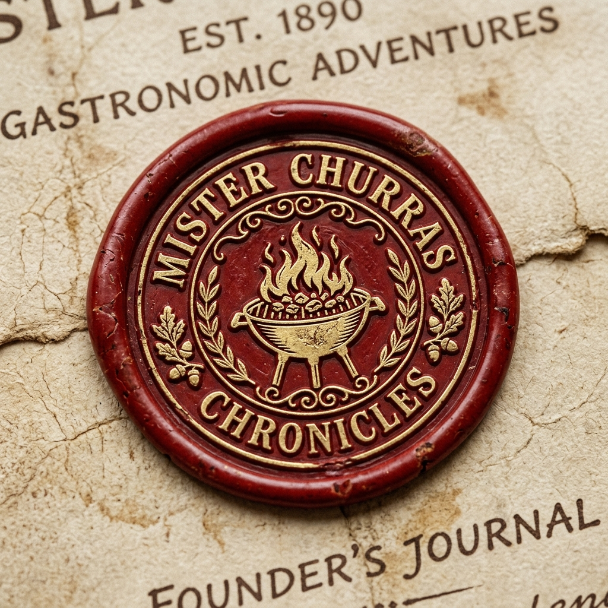

# 🔥 Mister Churras Chronicles © 1890

O Ritual do Churrasco Perfeito, consagrado pela Engenharia e pela Tradição.



## 📜 O Manifesto
O **Mister Churras Chronicles** não é apenas um calculador de carnes; é o guardião da brasa. Criado para o Mestre que exige precisão matemática sem abrir mão do luxo rústico, o app utiliza algoritmos avançados para garantir que as provisões nunca faltem e o desperdício seja banido da Confraria.

## 🛠️ Tecnologias de Elite
- **Frontend**: React 19 + TypeScript + Vite (Estética 1890 Chronicles)
- **Styling**: Tailwind CSS (Rustic-Premium Design System)
- **Backend**: Supabase (PostgreSQL, Auth & RLS)
- **Offline**: PWA (Progressive Web App) para uso em locais remotos.

## 🏰 Arquitetura do Ritual
1.  **Tamanho do Batalhão**: Defina quantos guerreiros (homens), damas (mulheres) e pequenos (crianças) integrarão o ritual.
2.  **O Mapa da Brasa**: Selecione os cortes sagrados e guarnições.
3.  **Consagrar o Corte**: Receba a lista exata de provisões, com a "Margem do Mestre" de 10% incluída.
4.  **Confraria (B2B)**: Portal exclusivo para açougues parceiros.

## 🛡️ Segurança e Governança
- **Blindagem .env**: Segredos protegidos via GitHub Secrets e Vercel.
- **Protocolo Maestro**: Fluxo de trabalho governado por agentes de IA especializados (Designer, Arquiteto, Coder e QA).
- **CI/CD**: Deploy contínuo via GitHub Actions para a Vercel.

## 🚀 Como Iniciar o Ritual (Local)
```bash
git clone https://github.com/Andre649/mister-churras-core.git
npm install
npm run dev
```

---
_Bucanero, o ritual agora é público e os segredos estão guardados._
**Mister Churras Chronicles - Onde a brasa encontra a precisão.**
