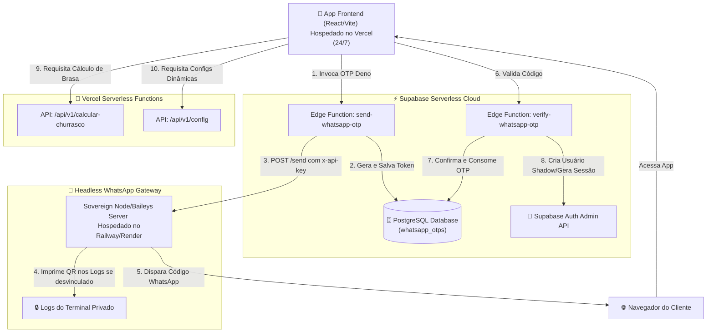

# 🔥 Mister Churras: O Braseiro — Arquitetura Soberana & Headless

Bem-vindo ao núcleo de engenharia do **Mister Churras: O Braseiro**. Este repositório abandona a linguagem gourmetizada e abraça o peso e o respeito dos grandes festivais de carne do Brasil (como o Festival Taurus). Adotamos uma arquitetura de microsserviços soberana, modular e de baixo custo, estruturada com segurança de nível corporativo e focada em execução contínua (24/7) na nuvem. A interface é crua, focada na experiência do balcão nacional.

---

## 🏛️ Visão Geral da Arquitetura

O ecossistema é dividido em três camadas desacopladas que se comunicam de forma segura através de APIs REST e middleware serverless, eliminando a dependência de intermediários caros (como Twilio ou Evolution API) e garantindo custos transacionais zero.



---

## 📁 Estrutura do Repositório (Clean Repository)

O repositório foi limpo e refatorado para manter uma estrutura enxuta, clara e sem duplicidade de configurações:

*   [web/](file:///d:/Mister-Churras/mister-churras-core/web): Aplicação frontend principal em React (Vite) utilizando TailwindCSS e seguindo a identidade estética "Rustic-Premium".
*   [web/supabase/](file:///d:/Mister-Churras/mister-churras-core/web/supabase): A única fonte de verdade da infraestrutura do Supabase local e de produção (contém o `config.toml`, migrações de banco e as Edge Functions).
*   [messaging-gateway/](file:///d:/Mister-Churras/mister-churras-core/messaging-gateway): Microsserviço independente em Node.js (TypeScript) que utiliza a biblioteca **Baileys** para emular uma sessão de WhatsApp. O gateway é **estritamente headless** (sem interface pública de QR code ou arquivos estáticos expostos).
*   [api/](file:///d:/Mister-Churras/mister-churras-core/api): Funções serverless da Vercel para execução rápida de cálculos de churrasco e provimento de configurações dinâmicas sem sobrecarregar o cliente.

---

## 🔒 Princípios de Segurança Aplicados (Zero-Trust)

Sob a auditoria contínua do nosso **Guardião da Brasa**, aplicamos as melhores diretrizes das normas **OWASP Top 10**, **ASVS** e **OWASP Top 10 for LLM Applications**:

### 1. Blindagem de Segredos (Secrets Isolation)
*   Nenhum segredo de backend (como `GEMINI_API_KEY`, `SUPABASE_SERVICE_ROLE_KEY` ou `GATEWAY_API_KEY`) é exposto no frontend React. O frontend nunca faz requisições diretas a APIs de terceiros.
*   Todo o tráfego que consome chaves de API trafega obrigatoriamente por **Edge Functions** (Supabase/Deno) ou rotas serverless na nuvem, que anexam as credenciais de forma oculta no ambiente de produção.

### 2. QR Code Blindado (Headless Pattern)
*   **O problema antigo:** Portais públicos que exibem o QR code de emparelhamento do WhatsApp na web são vulneráveis a ataques de sequestro de sessão e escaneamentos maliciosos.
*   **A nossa solução:** O gateway não expõe nenhuma rota visual `/qr` ou página HTML. O QR code é gerado em formato ASCII e exibido **estritamente dentro dos logs do console privado do servidor** (Railway/Render). Apenas administradores com acesso à conta de infraestrutura podem ver e emparelhar o dispositivo.

### 3. Autenticação REST Baseada em Headers
*   As rotas administrativas como `/status` e `/reset` são autenticadas por meio de cabeçalhos HTTP customizados (`x-api-key`). Não são aceitos tokens na URL (`?key=...`), impedindo o vazamento de chaves em logs de rede e no histórico dos navegadores.

### 4. Senhas Determinísticas Shadow
*   Como o envio de SMS oficial é oneroso, implementamos um sistema de login baseado em OTP via WhatsApp integrado ao módulo padrão do Supabase Auth.
*   O usuário digita seu WhatsApp, recebe o código pelo celular e, ao validar na nuvem do Supabase, o sistema cria/atualiza uma conta de login associada de forma segura e transparente por meio de senhas determinísticas geradas com segurança criptográfica (`PHONE_AUTH_SECRET`) que nunca saem do servidor.

---

## 🚀 Guia de Implantação e Execução na Nuvem (Production Setup)

Para manter o Mister Churras ativo 24/7 sem depender de nenhuma máquina física local ligada, siga este fluxo:

### 1. Banco de Dados e Segurança (Supabase Cloud)
Configure os segredos das suas Edge Functions no painel da nuvem do Supabase:
```bash
# Na pasta web/
npx supabase login
npx supabase secrets set --env-file supabase/.env --project-ref swtesjrevgxmfcumwxra
npx supabase functions deploy send-whatsapp-otp --project-ref swtesjrevgxmfcumwxra
npx supabase functions deploy verify-whatsapp-otp --project-ref swtesjrevgxmfcumwxra
```

### 2. Mensageria Soberana (Railway ou Render)
Faça o deploy do gateway de WhatsApp a partir dos scripts unificados na raiz do projeto:
```bash
# Para fazer o deploy automático no Railway:
node deploy-gateway.js railway SEU_TOKEN_RAILWAY

# Ou no Render:
node deploy-gateway.js render SEU_TOKEN_RENDER
```
*Após a inicialização do build na nuvem, abra a página de logs do painel da sua hospedagem e escaneie o QR Code exibido para conectar o seu WhatsApp permanentemente.*

### 3. Frontend e APIs Serverless (Vercel)
O repositório está totalmente configurado para integração contínua (CI/CD) com a Vercel. 
*   Basta conectar o seu repositório do GitHub ao painel da Vercel.
*   A Vercel lerá o arquivo vercel.json e compilará o frontend React e as APIs de cálculo contidas em api/ automaticamente em cada commit!

---

🔥 **Churrasco Garantido com Luxo Técnico e Soberania Criptográfica!** A brasa está quente e rodando sem parar nos melhores servidores de nuvem do mercado.
